<div align="center">


# WebToApp

**Verwandle jede Website in eine installierbare App — in Sekunden.**

Ein Link geht rein, fertige Produkte für **iPhone / iPad · Android · Windows · macOS · Linux** kommen raus — dazu ein öffentlicher App-Markt, Creator-Profile, Kommentare und Bewertungen, alles ohne Registrierung.

[](https://shiaho.sbs)
[](https://github.com/shiaho777/WebToApp/actions)
[](../LICENSE)
[](#was-du-bekommst)

[English](../README.md) · [简体中文](README.zh.md) · [日本語](README.ja.md) · [العربية](README.ar.md) · [Русский](README.ru.md) · [Español](README.es.md) · [Português](README.pt.md) · [Français](README.fr.md) · **Deutsch**

</div>

---

<p align="center">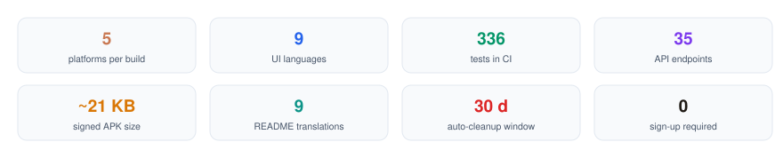</p>

## Was du bekommst

URL eingeben — oder eigenes `.html` / `.zip` hochladen — und Sekunden später hast du ein installierbares Ergebnis für alle Plattformen. Jedes Artefakt ist eine dünne native Hülle, die auf deine Seite zeigt: Die Pakete werden in **Kilobyte statt Megabyte** gemessen und laden fast sofort.

Jede generierte App lebt auf ihrer eigenen Download-Seite `/a/<id>`: Installationsoptionen pro Plattform, eine einklappbare Sektion „Über diese Seite", die der Creator mit echtem Inhalt füllen kann, und eine Community-Ebene mit Kommentaren und Sternebewertungen. Als öffentlichen Link veröffentlicht, erscheint sie außerdem im **App-Markt** für alle.

Open Source · Kostenlos · Keine Registrierung. Live ausprobieren: **[shiaho.sbs](https://shiaho.sbs)**.

---

## Screenshots

<p align="center">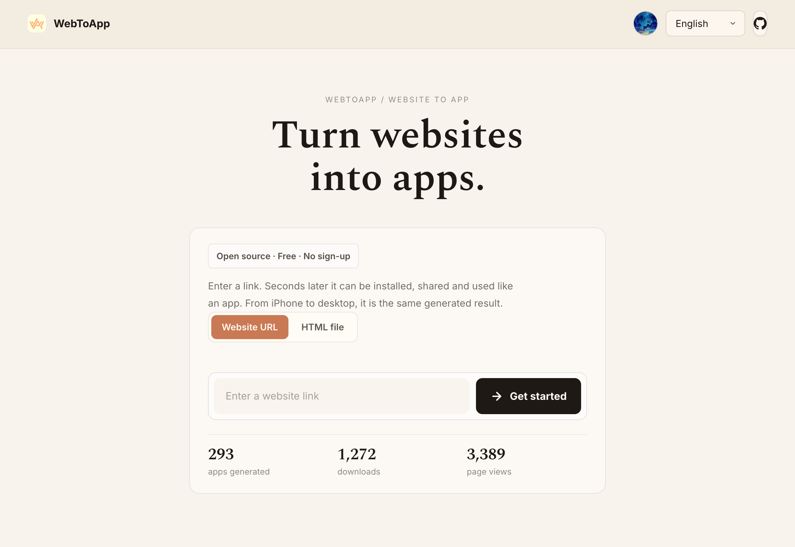</p>
<p align="center"><em>Link einfügen (oder eine HTML-Datei ablegen) — die Zähler sind live.</em></p>

<p align="center">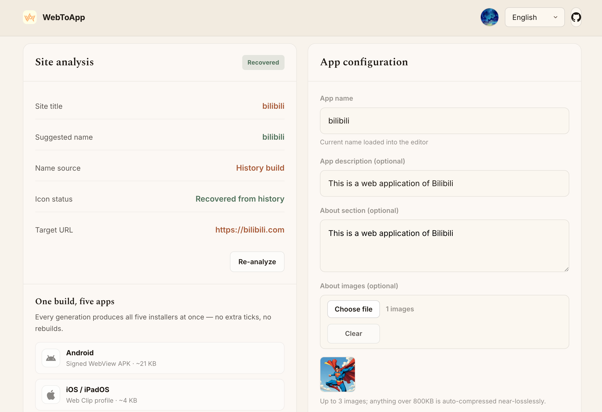</p>
<p align="center"><em>Name, einzeilige Beschreibung und die vom Creator geschriebene About-Sektion mit bis zu 3 Bildern — alles über 800 KB wird nahezu verlustfrei komprimiert.</em></p>

<p align="center">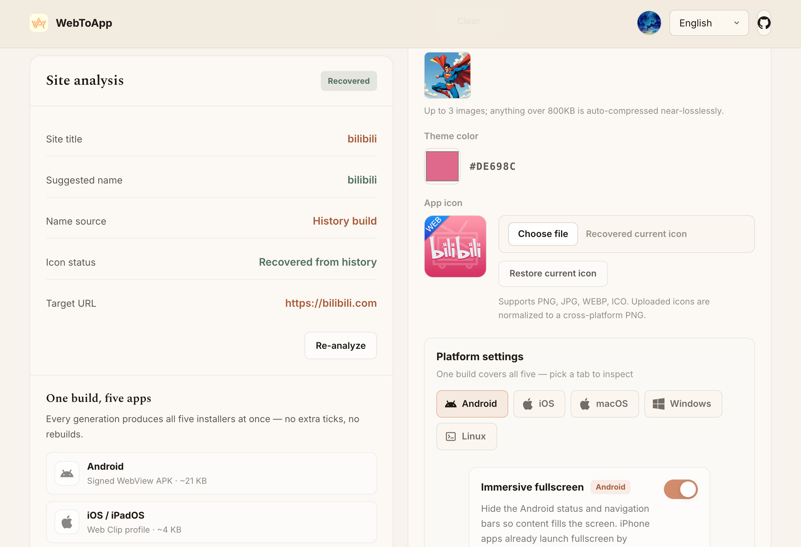</p>
<p align="center"><em>Theme-Farbe und Icon werden von der Seite übernommen; plattformspezifische Schalter wie Androids Immersive-Vollbild.</em></p>

<p align="center">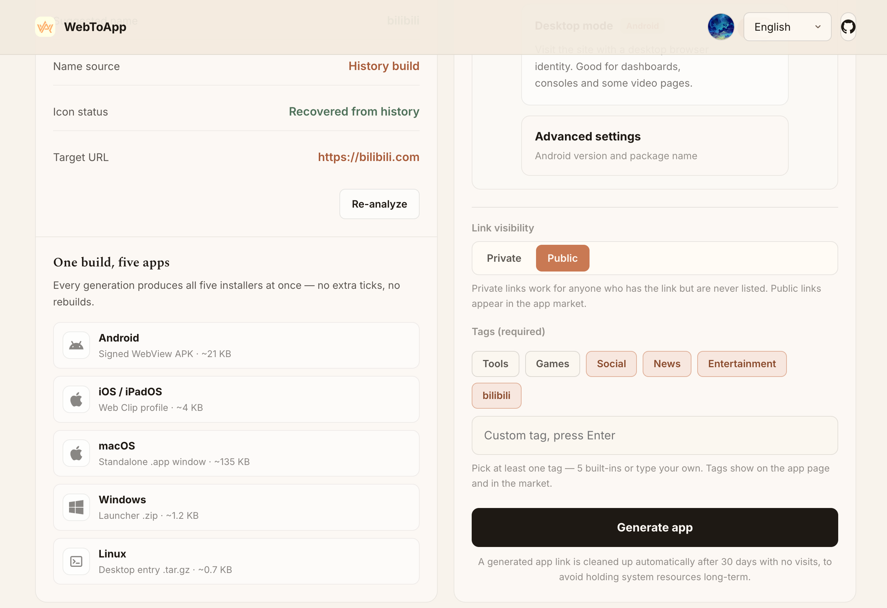</p>
<p align="center"><em>Standardmäßig privat oder öffentlich im Markt — Tags sind Pflicht, damit Apps auffindbar bleiben.</em></p>

<p align="center">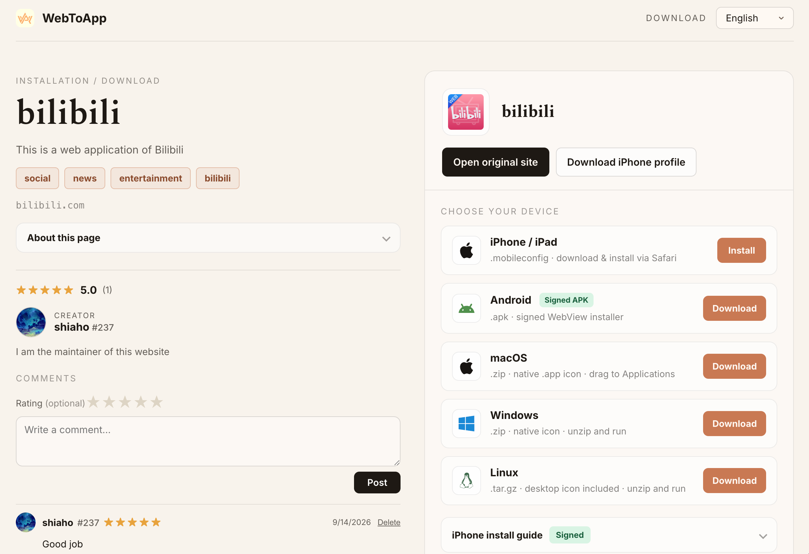</p>
<p align="center"><em>Die Seite der generierten App: Installationsliste rechts, Bewertung / Creator / Kommentare links.</em></p>

<p align="center">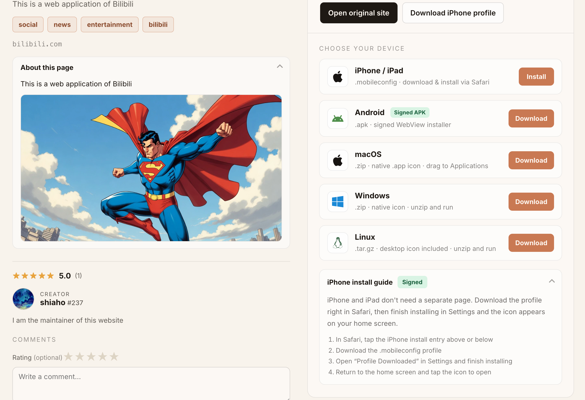</p>
<p align="center"><em>Die Sektion „Über diese Seite" trägt Text und Bilder des Creators — kein generischer Fülltext.</em></p>

<p align="center">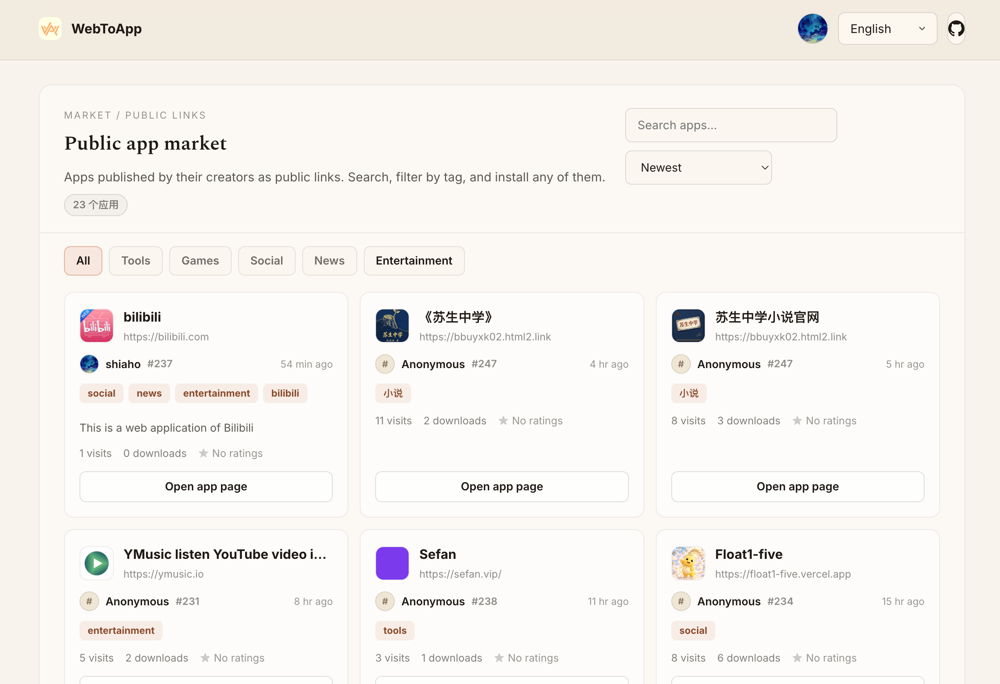</p>
<p align="center"><em>Der öffentliche Markt: Creator-Karten, Tag-Filter, Suche und Sortierung nach Neueste / Bestbewertet / Meiste Downloads / Meiste Besuche.</em></p>

<p align="center">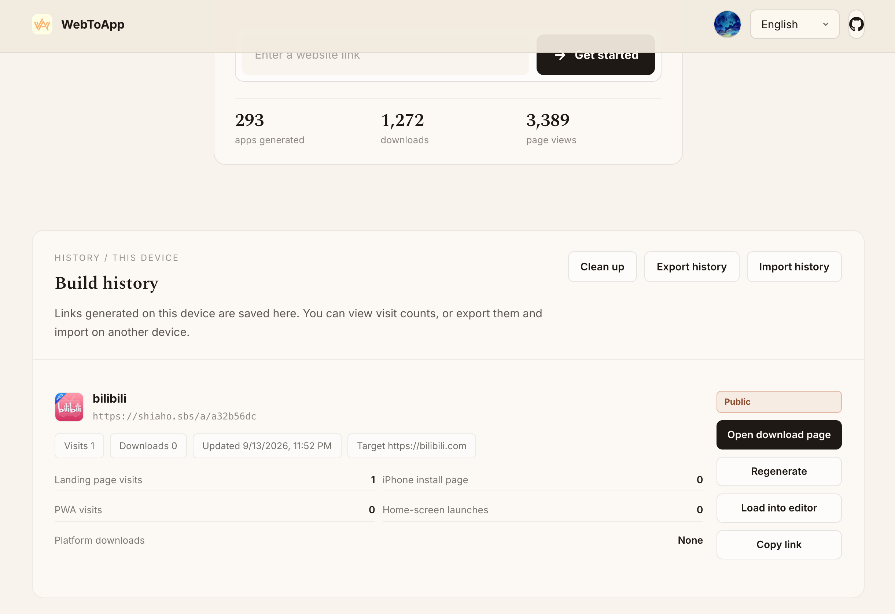</p>
<p align="center"><em>Dein Verlauf bleibt an den Geräte-Fingerprint gebunden — mit Besuchsstatistiken, Neu-Generieren und Export/Import zwischen Geräten.</em></p>

---

## Wie es funktioniert

<p align="center">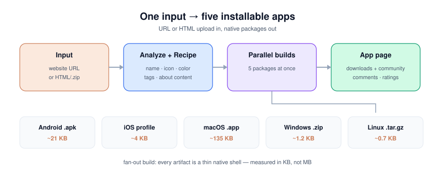</p>

1. **Eingabe** — Website-URL einfügen, oder ein einzelnes `.html` / ein `.zip` mit `index.html` hochladen. Hochgeladenes HTML wird vom Server unter `/a/<id>/site/...` gehostet und genau wie eine URL-App verpackt.
2. **Analyse + Recipe** — Der Analyzer holt die Seite und extrahiert Name, Theme-Farbe und Icon (multi-Kandidat, beste Auflösung gewinnt); alles, was der Build braucht, wird in einem `recipe.json` fixiert.
3. **Parallele Builds** — Die fünf Pakete werden gleichzeitig gebaut; scheitert eines (z. B. fehlende Android-Toolchain), degradiert nur diese Plattform.
4. **App-Seite** — Die Download-Seite rendert die Installations-Einträge pro Plattform, den About-Inhalt des Creators und den Community-Block.

## Funktionen

- **Zwei Eingabemodi**: Website-URL oder eigenes HTML (ein `.html` oder ein `.zip` mit `index.html` darin) — gehostet und verpackt wie jede URL-App.
- **Site-Analyse**: Name, Theme-Farbe, bestes auflösendes Icon und Zählung von Ads/Trackern/Popups (nur zur Anzeige geschätzt).
- **Multi-Plattform-Packaging**, ein Build → fünf Artefakte:
  - **Android** — ein echtes, installierbares WebView APK (v1+v2+v3 signiert), jede App mit **eigenem Signaturzertifikat**.
  - **iOS / iPadOS** — ein `.mobileconfig` Web-Clip-Profil, optional CMS-signiert mit öffentlichem CA-Zertifikat („unsignierte" Installation).
  - **macOS** — ein eigenständiges WKWebView `.app`-Fenster (keine Adressleiste, kein Drittanbieter-Browser).
  - **Windows / Linux** — leichte `.bat` / `.desktop` Launcher, die den System-Browser im App-Modus öffnen.
- **Creator-geschriebene About-Sektion**: Rich Text plus bis zu 3 Bilder auf jeder App-Seite. Uploads werden decode-verifiziert, von EXIF befreit und zu WebP re-encodiert — alles über 800 KB wird serverseitig nahezu verlustfrei komprimiert.
- **Community ohne Accounts**: Der Geräte-Fingerprint wird zu einer persistenten öffentlichen Identität (`?u=N`) — editierbarer Name, Markdown-Bio und Avatar. Creators werden auf ihren Apps verlinkt und haben eine öffentliche Profilseite.
- **Kommentare & Bewertungen**: Jede App-Seite hat einen Kommentar-Thread mit optionaler 1–5-Sterne-Bewertung; Durchschnitte erscheinen auf den Markt-Karten.
- **Öffentlicher App-Markt**: Tag-Filter, Suche und Sortierung nach Neueste, Bestbewertet (Durchschnitt → Anzahl), Meiste Downloads oder Meiste Besuche — mit relativen Zeitangaben.
- **Dynamischer URL-Tausch auf iOS**: Der Web Clip zeigt auf `/a/<id>/launch`, die Ziel-URL kann also serverseitig ohne Neuinstallation geändert werden.
- **Verlauf pro Gerät**: Builds werden gegen den Geräte-Fingerprint gespeichert, mit Besuchs-/Download-Statistiken, Neu-Generieren und Export/Import zwischen Geräten. Einträge zu löschen entfernt die App vollständig.
- **Automatische Bereinigung**: Apps ohne Besuche seit 30 Tagen werden automatisch eingesammelt.
- **Optionaler Cloudflare-R2-Offload**: Downloads werden ans CDN umgeleitet und schonen die Origin-Bandbreite.
- **Mehrsprachige UI**: 9 Sprachen — English, 简体中文, 日本語, العربية (RTL), Русский, Español, Português, Français, Deutsch — mit ebenfalls lokalisierten generierten Download-Seiten.

## Community ohne Anmeldung

<p align="center">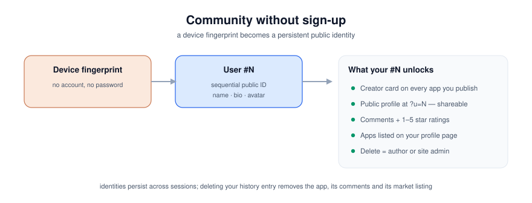</p>

Es gibt keine Registrierung: Beim ersten Auftauchen eines Geräts erhält sein Fingerprint eine sequentielle öffentliche Nummer. Diese `#N` wird zu einem echten Profil — Anzeigename, Markdown-Bio und Avatar setzen, und jede veröffentlichte App trägt deine Creator-Karte. Andere öffnen `?u=N`, um dein öffentliches Profil und deine Apps zu sehen. Kommentare nehmen optionale Sternebewertungen, die auf jeder Markt-Karte sichtbar sind.

## App-Größe

Jedes Paket ist ein dünner Einstiegspunkt zu deiner Seite — es bündelt keinen Seiteninhalt, also werden die Artefakte in **Kilobyte statt Megabyte** gemessen.

<p align="center">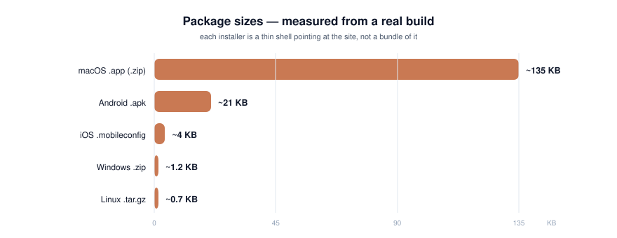</p>

| Plattform | Paket | Typische Größe | Inhalt |
| --- | --- | --- | --- |
| Android | `android.apk` | **~21 KB** | Ein echtes, installierbares WebView APK (v1+v2+v3 signiert) |
| iOS / iPadOS | `ios.mobileconfig` | **~4 KB** | Ein Web-Clip-Konfigurationsprofil |
| macOS | `macos.zip` | **~135 KB** | Ein `.app`-Bundle (natives WKWebView-Fenster + Icon) |
| Windows | `windows.zip` | **~1,2 KB** | Ein `.bat`-Launcher + Shortcut-Helfer + Icon |
| Linux | `linux.tar.gz` | **~0,7 KB** | Ein `.desktop`-Eintrag + Install-Skript + Icon |

## Tech-Stack

- Backend: Python + FastAPI + Uvicorn · SQLite-Stores (Verlauf, Tasks, Community)
- Frontend: Reines HTML / CSS / JS — kein Build-Schritt, direkt vom Backend ausgeliefert
- Packaging: Android SDK (aapt2 / d8 / apktool / apksigner / zipalign), Pillow, openssl
- CI: `pytest tests/` auf Python 3.10 / 3.11 / 3.12 — **336 Tests**

## Projektstruktur

```
.
├── index.html                 Landing Page + Build-Formular
├── css/ js/ assets/           Statische Frontend-Assets
│   ├── js/i18n.js             Leichtes i18n-Runtime (9 Sprachen)
│   ├── js/i18n.strings.js     Alle Übersetzungen
│   ├── js/community.js        Kommentare / Bewertungen / Creator-Block auf App-Seiten
│   └── js/mdmini.js           Winziges Markdown-Rendering für Bios
├── server/
│   ├── main.py                FastAPI-App und Routen (35 Endpunkte)
│   ├── config.py              Konfiguration per Umgebungsvariablen
│   ├── html_site.py           Staging / Validierung / Serving von HTML-Uploads
│   ├── history_store.py       Verlauf pro Gerät + App-/Besuchs-Statistiken (SQLite)
│   ├── community_store.py     Profile, Creators, Kommentare, Bewertungen (SQLite)
│   ├── task_store.py          Persistenz der Build-Queue (SQLite)
│   └── engine/
│       ├── analyzer.py        Site-Analyse
│       ├── distiller.py       Recipe → Pakete + Download-Seite (Kern)
│       ├── apk_builder.py     Android-APK-Build und -Signierung
│       ├── mobileconfig_signer.py  iOS-Profil-Signierung
│       ├── cache.py           Fetch-/Icon-Caches
│       └── storage.py         Cloudflare-R2-Offload
├── certs/                     Signiermaterial (private Schlüssel werden nicht committet)
└── generated/                 Zur Laufzeit erzeugte Apps und Daten (nicht committet)
```

## Schnellstart

Erfordert Python 3.10+. Das Android-APK braucht das Android SDK und `apktool` (fällt sonst auf ein Offline-PWA-Paket zurück).

```bash
# 1. Virtuelle Umgebung erstellen und Abhängigkeiten installieren
python3 -m venv venv
source venv/bin/activate
pip install -r server/requirements.txt

# 2. Konfigurieren (optional, alles hat Standardwerte)
cp .env.example .env
# .env nach Bedarf anpassen

# 3. Starten
uvicorn server.main:app --host 127.0.0.1 --port 8000
```

Öffne http://127.0.0.1:8000.

> Für lokale Entwicklung sind keine Umgebungsvariablen nötig. Für ein öffentliches Deployment setze `PUBLIC_BASE_URL`,
> sonst können iPhones `localhost` nicht öffnen. Die vollständige Liste steht in [`.env.example`](../.env.example).

## Deployment

> Eine vollständige Schritt-für-Schritt-Produktionsanleitung (systemd, Nginx, HTTPS, Android/iOS, R2) findest du in **[DEPLOY.md](DEPLOY.md)**.

In Produktion läuft es üblicherweise unter systemd hinter einem Nginx-Reverse-Proxy:

```ini
# /etc/systemd/system/webtoapp.service
[Unit]
Description=WebToApp
After=network.target

[Service]
WorkingDirectory=/path/to/web-to-app
Environment=PUBLIC_BASE_URL=https://your-domain.com
ExecStart=/path/to/web-to-app/venv/bin/uvicorn server.main:app --host 127.0.0.1 --port 8000
Restart=always

[Install]
WantedBy=multi-user.target
```

Für iOS-Profil-Signierung („unsignierte" Installation) siehe die Zertifikats-Einrichtung in [`certs/README.md`](../certs/README.md).

## Wie der Cloudflare-R2-Offload funktioniert

Generierte Installer können groß werden, und jeden Download vom Origin zu servieren kostet Bandbreite. Mit konfiguriertem R2:

1. **Nach jedem Build** wird jede Datei in `generated/<app_id>/downloads/` unter dem Schlüssel `<app_id>/downloads/<filename>` nach R2 gespiegelt (`server/engine/storage.py`), und die resultierenden öffentlichen URLs werden als `downloads_cdn`-Map in das `recipe.json` der App geschrieben.
2. **Beim Download** bevorzugt `GET /a/<id>/download/<platform>` die CDN-URL aus `downloads_cdn` und liefert einen **302-Redirect** zu R2; falls nicht vorhanden, fällt es auf lokales Streaming zurück. Das Origin verbraucht CPU beim Build, nicht Bandbreite bei jedem Teilen oder QR-Scan.
3. **Bei der Bereinigung** werden die Objekte einer App unter `<app_id>/` zusammen mit ihren lokalen Daten aus R2 entfernt.

Fehlt eine `R2_*`-Variable, ist das Feature no-op und Downloads werden lokal serviert — nichts bricht. Apps, die vor der R2-Aktivierung erstellt wurden, können mit `python -m server.scripts.backfill_r2` migriert werden. Die kompletten Schritte (Bucket, API-Token, öffentlicher Zugriff, Custom Domain, Backfill) stehen in [DEPLOY.md §11](DEPLOY.md#11-cloudflare-r2-offload-optional).

## Sicherheitshinweise

- Alle Secrets (R2, Cloudflare, Signatur-Passwörter) werden aus Umgebungsvariablen gelesen; das Repository enthält keine echten Credentials.
- **Private Signaturschlüssel (`certs/*.keystore`, `certs/app-keys/`) und Laufzeitdaten (`generated/`) sind standardmäßig per `.gitignore` ausgeschlossen — committe sie niemals.**
- Jede generierte Android-App nutzt ein eigenes unabhängiges Signaturzertifikat — das verhindert, dass der Zertifikats-Fingerprint massenhaft geflaggt wird, und erlaubt In-place-Updates derselben App.
- Von Creators hochgeladene About-Bilder werden per Pillow decode-verifiziert, durch Rohgrößen-/Pixel-/Anzahl-Obergrenzen begrenzt, von Metadaten befreit und zu WebP re-encodiert — niemals werden sie so ausgeliefert wie hochgeladen.
- Nutzergenerierter Text wird beim Rendern HTML-escaped; App-Medien-Routen erlauben nur server-generierte Dateinamen.

## Lizenz

[MIT](../LICENSE)
